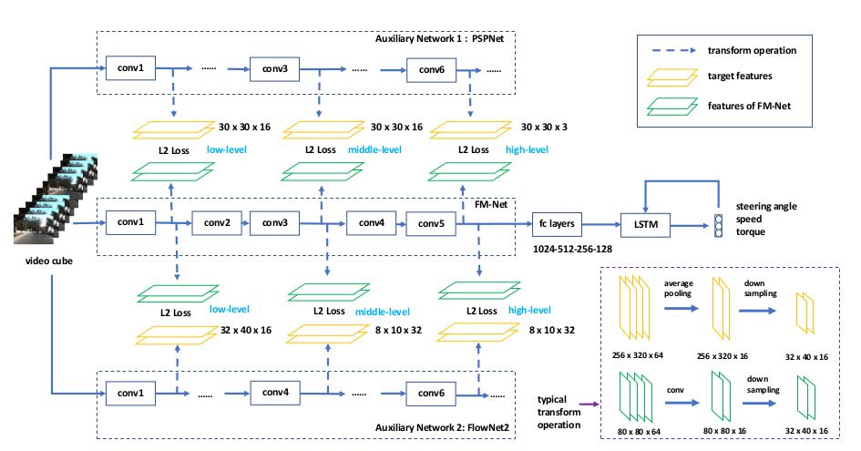

Codes for ["Learning to Steer by Mimicking Features from Heterogeneous Auxiliary Networks"](https://arxiv.org/abs/1811.02759). (Coming soon!)

Besides, our project page is now available at [FM-Net](https://cardwing.github.io/projects/FM-Net).



### Demo video

- Performance of auxiliary networks on unseen target data:


- Performance of FM-Net:


### Main Content:

|Tasks|Framework|Original Author|Modified By|State|
|:---:|:---:|:---:|:---:|:---:|
|Semantic segmentation|Pytorch|[Li Xiaoxiao](https://scholar.google.com.hk/citations?user=udZam0oAAAAJ&hl=zh-CN)|HOU Yuenan|already released|
|Steering angle prediction|Tensorflow|[HOU Yuenan](https://cardwing.github.io/)|--|to be released|
|Lane detection|Torch|[Pan Xinggang](https://github.com/XingangPan)|HOU Yuenan|to be released|
|Lane detection|Tensorflow|[Luo Yao](https://github.com/MaybeShewill-CV)|HOU Yuenan|on-going|

### Prerequisites

- Tensorflow 1.4.0

### Installations
    conda create -n tensorflow_gpu pip python=2.7
    source activate tensorflow_gpu
    pip install --upgrade tensorflow-gpu==1.4

### Run the code in pytorch-semantic-segmentation-master

FCN (mIoU 71.03%)
```{r, engine='bash', count_lines}
python3 main.py VOCAug FCN train val --lr 0.01 --gpus 0 1 2 3 4 5 6 7 --npb
```

PSPNet
```{r, engine='bash', count_lines}
python3 train_pspnet.py VOCAug PSPNet train val --lr 0.01 --gpus 0 1 2 3 4 5 6 7 --npb --test_size 473
```

### Testing


### Training


### To do list:

- Release the codes for steering control soon

- Clean all codes, make them readable and reproducable

- Put codes of steering angle prediction (tensorflow) and lane detection (torch and pytorch) here

- Attach original experimental results here to facilitate future research


### Citation

If you use the codes, please cite the following publications:

``` 
@inproceedings{xxx,
 author = {Yuenan Hou, Zheng Ma, Chunxiao Liu, and Chen Change Loy},
 title = {Learning to Steer by Mimicking Features from Heterogeneous Auxiliary Networks},
 booktitle = {AAAI Conference on Artificial Intelligence (AAAI)},
 month = {January},
 year = {2019} 
}
```

### Acknowledgement
This repo is built upon [Udacity](https://github.com/udacity/self-driving-car)


### Contact
If you have any problems in reproducing the results, just raise an issue in this repo.
